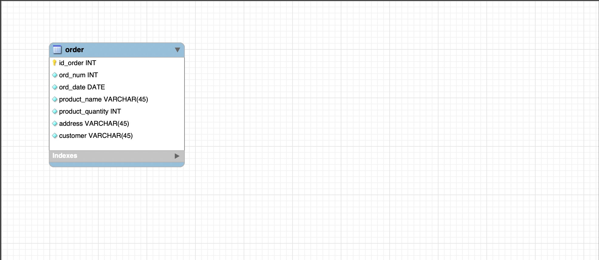
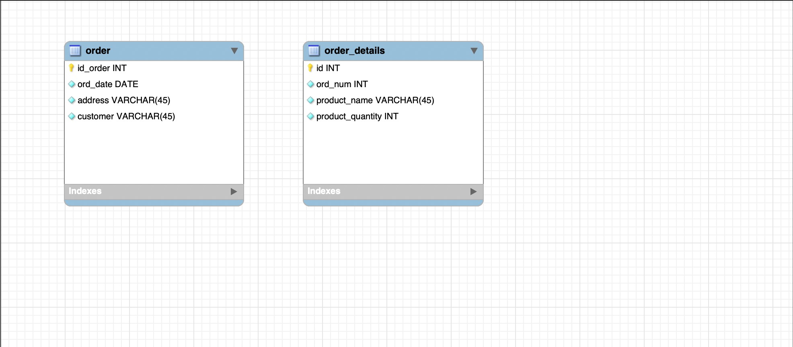
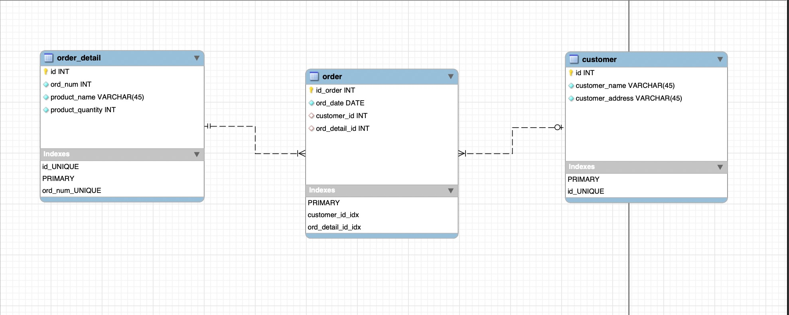
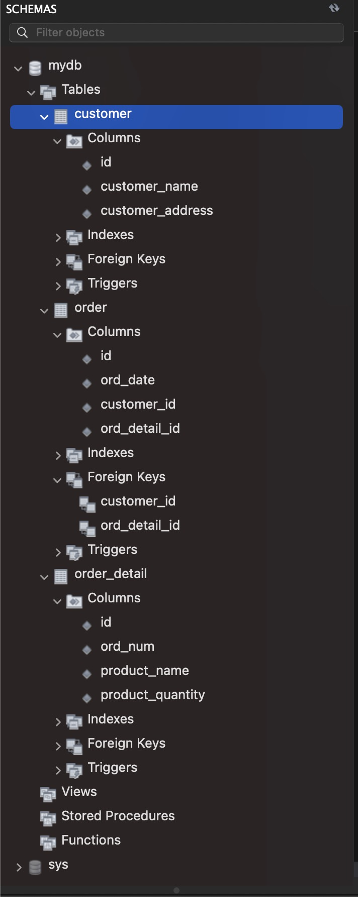

# Крок 4

* [x] &#x20;**Крок 4. Результати розробки ER-діаграми отриманих таблиць.**

Результат нормалізації за 1NF

<figure><figcaption>
1 normal form
</figcaption></figure>

Результат нормалізації за 2NF

<figure><figcaption>
2 normal form
</figcaption></figure>

Результат нормалізації за 3NF

<figure><figcaption>
3 normal form
</figcaption></figure>

Database schema

<figure><figcaption>
Database schema
</figcaption></figure>

