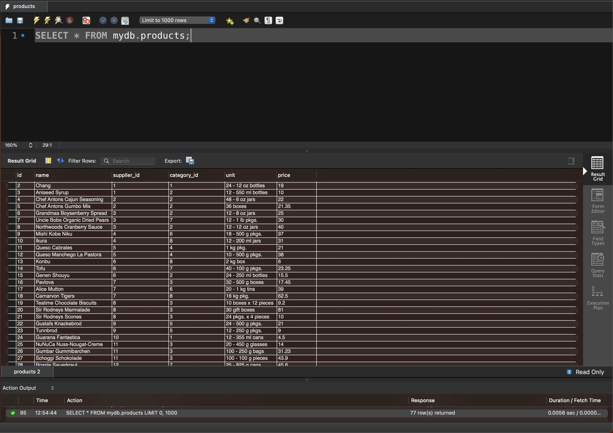
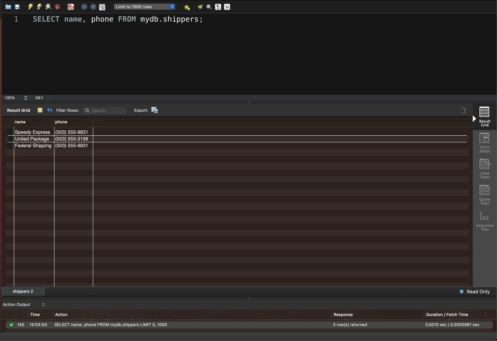

# Task 1

Напишіть SQL команду, за допомогою якої можна:

* вибрати всі стовпчики (За допомогою wildcard “\*”) з таблиці `products`;
* вибрати тільки стовпчики _name_, _phone_ з таблиці `shippers`_,_

та перевірте правильність її виконання в MySQL Workbench.


```sql
SELECT * FROM mydb.products;
```

<figure><figcaption></figcaption></figure>

```sql
SELECT name, phone FROM mydb.shippers;
```

<figure><figcaption></figcaption></figure>
