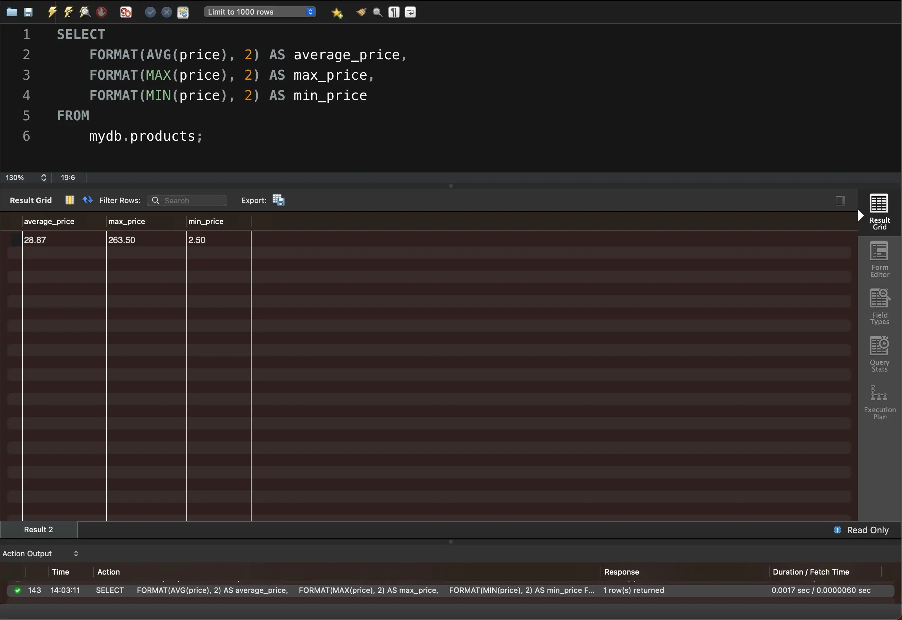

# Task 2

Напишіть SQL команду, за допомогою якої можна знайти середнє, максимальне та мінімальне значення стовпчика _price_ таблички `products`_,_ та перевірте правильність її виконання в MySQL Workbench.

```sql
SELECT 
    FORMAT(AVG(price), 2) AS average_price,
    FORMAT(MAX(price), 2) AS max_price,
    FORMAT(MIN(price), 2) AS min_price
FROM
    mydb.products;
```

<figure><figcaption></figcaption></figure>

Файл з результатами у CSV-форматі


