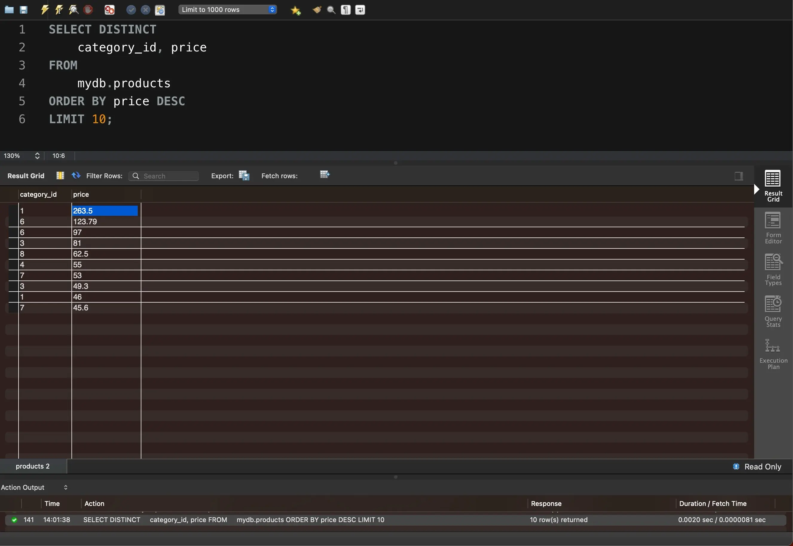

# Task 3

Напишіть SQL команду, за допомогою якої можна обрати унікальні значення колонок _category\_id_ та _price_ таблиці `products`_._

Оберіть порядок виведення на екран за спаданням значення _price_ та виберіть тільки 10 рядків. Перевірте правильність виконання команди в MySQL Workbench.

```sql
SELECT DISTINCT
    category_id, price
FROM
    mydb.products
ORDER BY price DESC
LIMIT 10;
```

<figure><figcaption></figcaption></figure>

Файл з результатами у CSV-форматі


