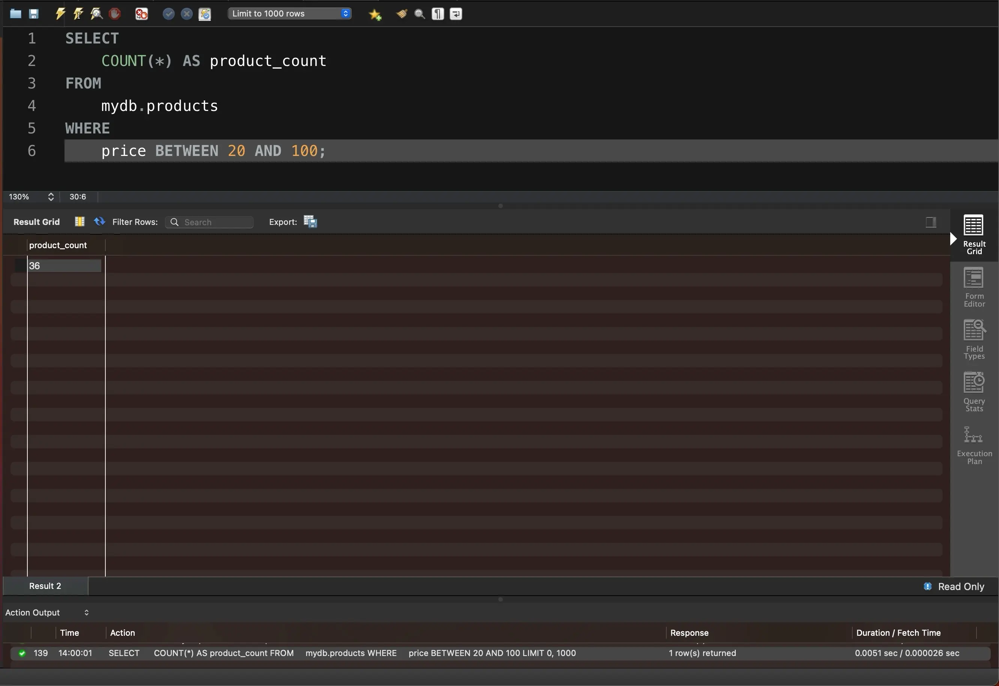

# Task 4

Напишіть SQL команду, за допомогою якої можна знайти кількість продуктів (рядків), які знаходиться в цінових межах від 20 до 100, та перевірте правильність її виконання в MySQL Workbench.

```sql
SELECT 
    COUNT(*) AS product_count
FROM
    mydb.products
WHERE
    price BETWEEN 20 AND 100;
```

<figure><figcaption></figcaption></figure>

Файл з результатами у CSV-форматі


