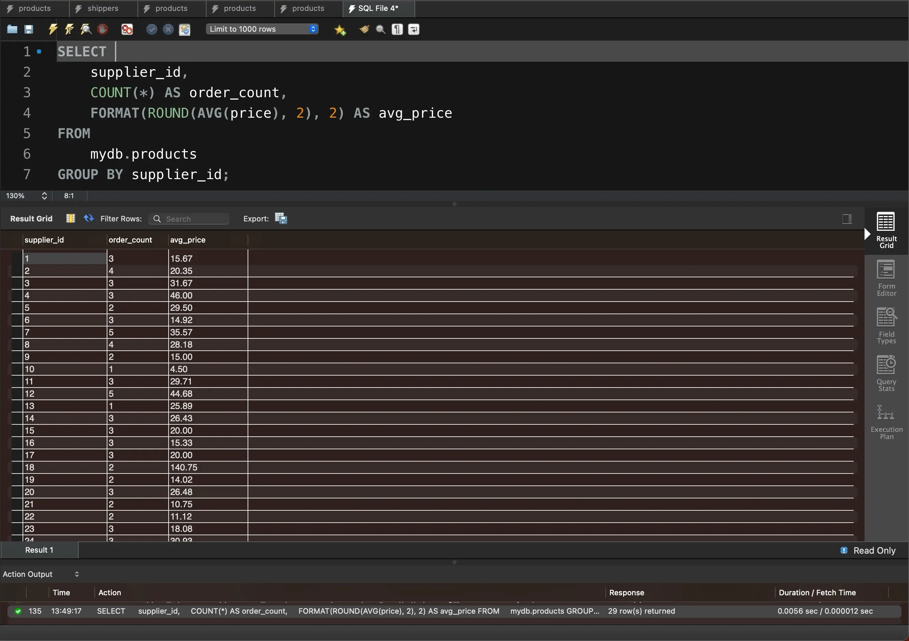

# Task 5

Напишіть SQL команду, за допомогою якої можна знайти кількість продуктів (рядків) та середню ціну (_price_) у кожного постачальника (_supplier\_id_), та перевірте правильність її виконання в MySQL Workbench.

```sql
SELECT 
    supplier_id,
    COUNT(*) AS order_count,
    FORMAT(ROUND(AVG(price), 2), 2) AS avg_price
FROM
    mydb.products
GROUP BY supplier_id;
```

<figure><figcaption></figcaption></figure>

Файл з результатами у CSV-форматі


