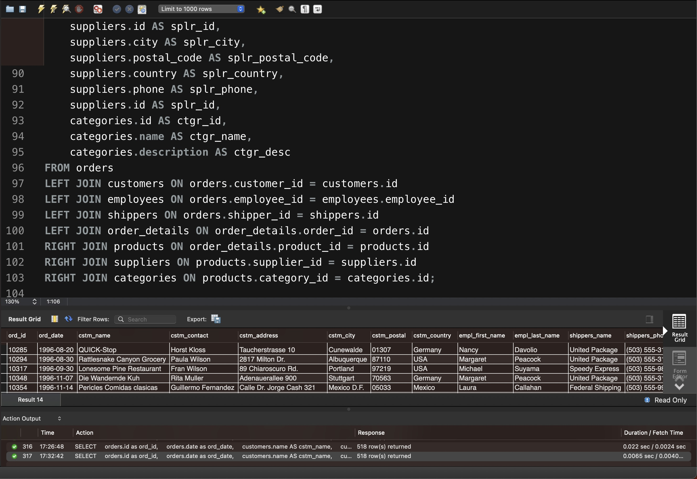

# Step 5. LEFT / RIGHT JOIN combinations

```sql
SELECT
    orders.id as ord_id,
    orders.date as ord_date,
    customers.name AS cstm_name,
    customers.contact AS cstm_contact,
    customers.address AS cstm_address,
    customers.city AS cstm_city,
    customers.postal_code AS cstm_postal,
    customers.country AS cstm_country,
    employees.first_name AS empl_first_name,
    employees.last_name AS empl_last_name,
    shippers.name AS shippers_name,
    shippers.phone AS shippers_phone,
    order_details.id as ord_details_id,
    order_details.quantity as ord_details_quantity,
    products.id as prod_id,
    products.unit as prod_unit,
    products.price as prod_price,
    products.id as prod_id,
    suppliers.id AS splr_id,
    suppliers.name AS splr_name,
    suppliers.contact AS splr_contact,
    suppliers.address AS splr_address,
    suppliers.id AS splr_id,
    suppliers.city AS splr_city,
    suppliers.postal_code AS splr_postal_code,
    suppliers.country AS splr_country,
    suppliers.phone AS splr_phone,
    suppliers.id AS splr_id,
    categories.id AS ctgr_id,
    categories.name AS ctgr_name,
    categories.description AS ctgr_desc
FROM orders
LEFT JOIN customers ON orders.customer_id = customers.id
LEFT JOIN employees ON orders.employee_id = employees.employee_id
LEFT JOIN shippers ON orders.shipper_id = shippers.id
LEFT JOIN order_details ON order_details.order_id = orders.id
RIGHT JOIN products ON order_details.product_id = products.id
RIGHT JOIN suppliers ON products.supplier_id = suppliers.id
RIGHT JOIN categories ON products.category_id = categories.id;
```

<figure><figcaption><p>SQL query result</p></figcaption></figure>

Теоретично при зміні операторів `INNER JOIN` на `LEFT JOIN` або `RIGHT JOIN`, кількість рядків, які повертаються запитом, може змінитися.

1. `INNER JOIN`: Повертає тільки ті рядки, які мають відповідності в обох таблицях. Якщо в одній з таблиць немає відповідного рядка, то цей рядок не буде включено в результати запиту.
2. `LEFT JOIN`: Повертає всі рядки з лівої таблиці (першої таблиці у JOIN), а також відповідні рядки з правої таблиці (другої таблиці). Якщо немає відповідності, то всі стовпці правої таблиці будуть заповнені значенням NULL. Це може призвести до збільшення кількості рядків, якщо в лівій таблиці є рядки без відповідностей у правій таблиці.
3. `RIGHT JOIN`: Повертає всі рядки з правої таблиці і відповідні рядки з лівої таблиці. Якщо немає відповідності, то всі стовпці лівої таблиці будуть заповнені значенням NULL. Це може призвести до збільшення кількості рядків, якщо в правій таблиці є рядки без відповідностей у лівій таблиці.

#### Результат отриманого запиту



#### Оцінка отриманих результатів:

Через те, що у всіх таблицях, які беруть участь в об’єднанні, є відповідні значення, то результат буде однаковим. У такому випадку:

* `INNER JOIN` поверне тільки ті рядки, які мають відповідності в обох таблицях.
* `LEFT/RIGHT JOIN` поверне всі рядки з правої таблиці та відповідні рядки з лівої таблиці. Якщо праву таблицю можна відобразити у відповідності з лівою, то результат буде таким же, як і у випадку з `INNER JOIN`.

