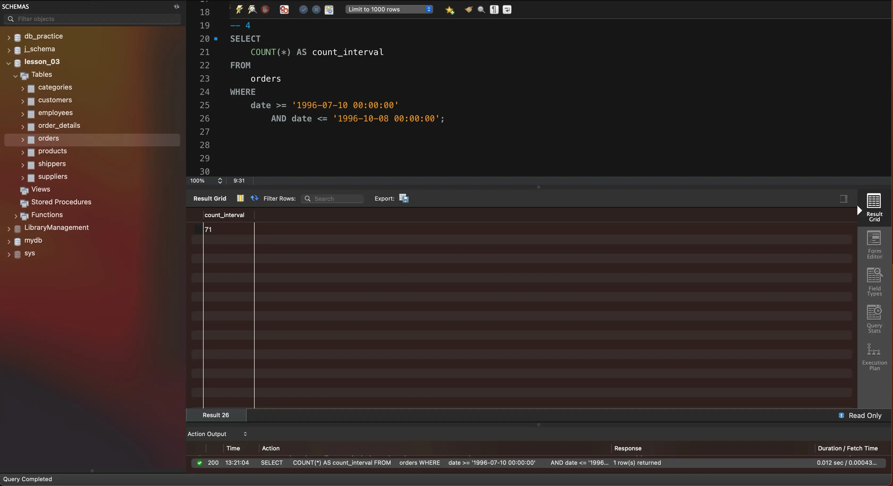

---
layout:
  title:
    visible: true
  description:
    visible: false
  tableOfContents:
    visible: true
  outline:
    visible: true
  pagination:
    visible: true
---

# Tasks

1\. Напишіть SQL-запит, який для таблиці `orders` з атрибута `date` витягує рік, місяць і число. Виведіть на екран їх у три окремі атрибути поряд з атрибутом `id` та оригінальним атрибутом `date` (всього вийде 5 атрибутів).

```sql
USE lesson_03;

SELECT 
    id,
    date,
    YEAR(date) AS year,
    MONTH(date) AS month,
    DAY(date) AS day
FROM
    orders;
```

Результат виконання запиту:

<figure><figcaption></figcaption></figure>

2\. Напишіть SQL-запит, який для таблиці `orders` до атрибута `date` додає один день. На екран виведіть атрибут `id`, оригінальний атрибут `date` та результат додавання.

```sql
SELECT id, date, date + INTERVAL 1 DAY FROM orders;
```

Результат виконання запиту:

<figure><figcaption><p>task-02</p></figcaption></figure>

3\. Напишіть SQL-запит, який для таблиці `orders` для атрибута `date` відображає кількість секунд з початку відліку (показує його значення timestamp). Для цього потрібно знайти та застосувати необхідну функцію. На екран виведіть атрибут `id`, оригінальний атрибут `date` та результат роботи функції.

```sql
SELECT id, date, UNIX_TIMESTAMP(date) FROM orders;
```

Результат виконання запиту:

<figure><figcaption><p>task-03</p></figcaption></figure>

4\. Напишіть SQL-запит, який рахує, скільки таблиця `orders` містить рядків з атрибутом `date` у межах між `1996-07-10 00:00:00` та `1996-10-08 00:00:00`.

```sql
SELECT 
    COUNT(*) AS count_interval
FROM
    orders
WHERE
    date >= '1996-07-10 00:00:00'
        AND date <= '1996-10-08 00:00:00';
```

Результат виконання запиту:

<figure><figcaption><p>task-04</p></figcaption></figure>

5\. Напишіть SQL-запит, який для таблиці `orders` виводить на екран атрибут `id`, атрибут `date` та JSON-об’єкт `{"id": <атрибут id рядка>, "date": <атрибут date рядка>}`. Для створення JSON-об’єкта використайте функцію.

```sql
SELECT 
    id,
    date,
    JSON_OBJECT('id', id, 'date', date) AS data_to_json
FROM
    orders;
```

Результат виконання запиту:

<figure><figcaption><p>task-05</p></figcaption></figure>
